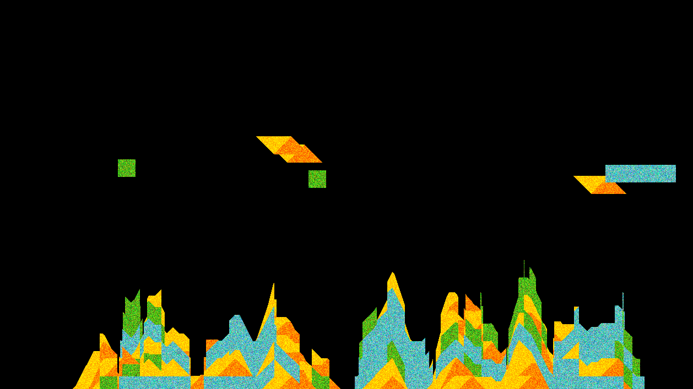

# 2D_Falling_Pixel_Blocks
More falling block ideas this time using blocks made of pixels. This means that when the blocks reach the end of the fall they will deform based on whatever shape is below.

Very basic idea, just a thought I had, press SPACE to create a falling block

